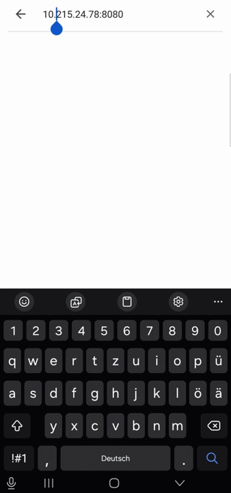
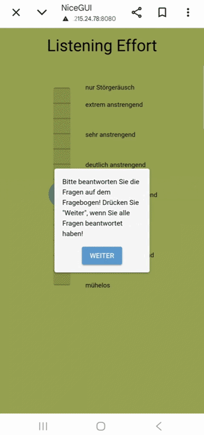

# le slider
A flexible Python framework for collecting continuous ratings of psychoacoustic stimuli from participants using a slider interface.
Originally built for subjective Listening Effort (LE) assessment ([see citation](#citation)), but the project offers easy ways of customization for other types of psychoacoustic percepts.
___

# Table of Contents
- [Setup](#setup)
    - [Installation](#installation-️)
    - [Project Structure](#project-structure-)
- [Usage](#usage)
    - [Before You Start](#before-you-start-)
        - [Required Hardware](#required-hardware-)
        - [Customizable Paths](#customizable-paths-)
        - [Creating Measurement Lists](#creating-measurement-lists-)
        - [Calibration](#calibration-️)
    - [Starting the App](#starting-the-app-️)
        - [Settings](#settings-)
        - [Assessment](#assessment-)
    - [Load Ratings](#load-ratings-)
- [Customization](#customization)
    - [Slider Configuration](#slider-configuration-️)
    - [Dialog Customization](#dialog-customization-)
- [Troubleshooting](#troubleshooting)
- [FAQ](#faq)
- [License](#license)
- [Acknowledgements](#acknowledgements)
- [Citation](#citation)
___

# Setup

## Installation 🛠️
This project has been tested on Windows 11 and should work on macOS and Linux as well.
[Python 3.11.3](https://www.python.org/downloads/release/python-3113/) is recommended, though other Python 3.10+ versions may work.

### Step 1: Clone or Download the Project

Then navigate to the project directory:
```bash
cd /path/to/le_slider
```

### Step 2: Virtual Environment

Create a virtual environment like this:
```bash
python -m venv .venv
```

Then activate the environment like this (**Windows**):
```cmd
.venv\Scripts\activate
```

...or like this for **macOS/Linux**:
```bash
source .venv/bin/activate
```

### Step 3: Install Dependencies

Just run:
```bash
pip install -r requirements.txt
```

## Project Structure 📂
These are the most relevant directories and files:

```
├── examples
│   ├── ...EXAMPLE SCRIPTS FOR DATA PROCESSING AND VISUALIZATION

├── functions
│   ├── ...CORE MODULES FOR AUDIO, GUI, AND NETWORKING

├── measurement_lists
│   ├── ...COPY YOUR LISTS FOR STIMULUS ORDER HERE! 

├── results
│   ├── ...SLIDER RECORDINGS WILL GO HERE

├── requirements.txt    REQUIRED PYTHON PACKAGES
├── slider_app.py       MAIN SCRIPT TO START MEASUREMENT
```
___

# Usage 
The general idea of this project is to play dynamic stimuli to participants via headphones, while they can continuously rate listening effort using the slider.

## Before You Start ✋

### Required Hardware 🎧
You will at least need **headphones** and a **sound device** that has a **minimum of two output channels**. The code will play audio to channels 0 and 1 (left and right ear).
For using a **smartphone** to control the slider interface, you will need a **local network**. You can use a WiFi router or create a smartphone hotspot. The computer running the code and the smartphone must be **on the same network**. **Important:** Corporate or institutional networks (e.g., university WiFi) may block the required ports or allow other users to interfere with your connection. A dedicated personal network is strongly recommended for reliable operation.

### Customizable Paths 📂
By default, the application looks for measurement lists in the `measurement_lists/` directory and writes results to the `results/` directory. Calibration JSON files are automatically discovered from the `calib/` directory. You can customize these paths by editing [config/paths.yaml](config/paths.yaml):

```yaml
measurement_lists: 'measurement_lists/'       # Directory containing stimulus list files
results: 'results/'                           # Directory for saving ratings
calibration_filepath: 'path/to/calib_noise.wav'   # Path to calibration signal file
```

**⚠️ Important:** You **must** update the `calibration_filepath` to point to your actual calibration audio file (e.g., speech-shaped noise). The calibration script reads this file. Replace it with the absolute or relative path to your calibration signal:
```yaml
calibration_filepath: 'C:/path/to/your/calib_noise.wav'
```

### Creating Measurement Lists 📋
A measurement list defines the order of any number of stimuli to be used for the continuous assessment. You can create any number of measurement lists to the `measurement_lists` directory. A measurement list must be a `.txt` file, where every line contains a filepath, like for example:
```
C:/Users/username/Desktop/awesome_stimuli/stimulus1.wav
C:/Users/username/Desktop/awesome_stimuli/stimulus2.wav
../parallel_directory/another_stimulus.wav
```
**Filenames have to be unique, because the results will be saved with the same base name as the audio file!**
Note that it can be absolute or relative paths, but using absolute ones might be less error prone.
Files are played back in the measurement in the order from top to bottom.

### Calibration 🎛️
Calibration ensures that stimuli are presented at a defined Sound Pressure Level (SPL) at the listener's ears. The procedure measures the actual playback level and stores per-channel correction gains that are automatically applied to all stimuli during measurement.

#### Setup

Point to your calibration signal file (e.g., speech-shaped noise) by setting `calibration_filepath` in [config/paths.yaml](config/paths.yaml):

```yaml
calibration_filepath: 'C:/path/to/your/calib_noise.wav'
```

A speech-shaped noise signal is recommended because its long-term spectrum matches that of typical speech stimuli, giving a representative calibration level.

#### Running Calibration

```bash
python calibrate.py
```

1. **Select audio device**: Choose the audio interface you'll use for the measurement
2. **Select blocksize**: Choose appropriate buffer size (512-2048 samples)
3. Click **Submit** to proceed
4. Click **Start** to begin looped playback of the calibration signal through headphones
5. Measure sound pressure level (SPL) at both ears using a sound level meter
6. Enter measured SPL for **left ear** and **right ear** separately  
7. Enter **desired target SPL** (presentation level for stimuli)
8. Click **Save Calibration**

#### Multi-Calibration Support

Each calibration is automatically saved with a **unique timestamp** and **device metadata** to the `calib/` directory as a JSON file:
```
calib/
├── calib_2026-05-28T13-26-08.json     ← Realtek Audio, 48 kHz
├── calib_2026-05-28T15-30-43.json     ← USB Headset, 44.1 kHz
└── calib_2026-05-29T10-15-22.json     ← Realtek Audio, 44.1 kHz
```

This allows you to:
- **Calibrate different audio devices** without re-running measurements
- **Switch calibrations** during measurement setup based on available hardware
- **Maintain a history** of all calibrations performed

**Each calibration file stores:**
- Audio device ID and name
- Sampling rate (fs)
- SPL measurements (left/right/desired)
- Calibration gains for each channel
- Session ID for traceability

#### How It Works

For each ear independently, the calibration gain is:

$$g = 10^{(SPL_\text{desired} - SPL_\text{measured}) / 20}$$

This linear amplitude gain is multiplied into the audio signal for that channel before playback, so the stimulus reaches the participant's ear at the target SPL regardless of the playback chain's characteristics.

| Field | Description |
|---|---|
| Measured SPL — Left (dB) | SPL reading from the sound level meter at the left ear |
| Measured SPL — Right (dB) | SPL reading from the sound level meter at the right ear |
| Desired SPL (dB) | Target presentation level for both ears |

> ⚠️ **Recalibrate** whenever you change the audio device, the headphones, or the volume setting of the sound card. Simply run `python calibrate.py` again to create a new calibration file for the new configuration.

---

## Starting the App ▶️
Run the slider script:
```bash
python slider_app.py
```

The code will output an address to the terminal that you can enter in a browser on your smartphone to use the slider interface via smartphone. The computer running the code must be in the same network as the smartphone!

### Settings ⚙️
<table cellpadding="0" cellspacing="0">
  <tr>
    <td width="40%" style="border: none;">
      
    </td>
    <td style="border: none; padding-right: 20px;">
You will be prompted with a settings dialog where you can configure the participant identifier, select a calibration, choose the measurement list, audio device and blocksize.

After accepting the settings, you can hand the smartphone to the participant.
    </td>
  </tr>
</table>

- **Calibration**: Select a saved calibration from your available options. The display shows:
  - Device name and sampling rate (e.g., "Realtek Audio (48000 Hz)")  
  - Calibration timestamp (e.g., "2026-05-28 13:26")

- **Participant ID**: A unique identifier for this assessment session

- **Measurement List**: Select your prepared stimulus list from the `measurement_lists/` directory

- **Audio Device**: Automatically pre-selected based on your chosen calibration. The device dropdown is **locked** to prevent manual changes—the device and sampling rate are determined by the calibration to ensure correct gain application.

- **Blocksize**: The buffer size for audio playback (e.g., 512, 1024, 2048). Smaller values reduce latency but may cause audio dropouts on slower systems. Start with 1024 if you experience issues.


### Assessment 🎚️
<table cellpadding="0" cellspacing="0">
  <tr>
    <td style="border: none; padding-right: 20px;">
Before each stimulus, a pre-stimulus dialog appears that the participant accepts to start playback and begin continuous rating.
During playback, the participant adjusts the slider to reflect their real-time assessment. Ratings are recorded at regular intervals.
After each stimulus, a post-stimulus dialog appears. Once dismissed, the code proceeds to the next stimulus with the same process.
Finally, an end screen confirms that the measurement is complete.
    </td>
    <td width="40%" style="border: none;">
      
    </td>
  </tr>
</table>

All ratings are automatically saved to `results/` as `<participant ID>_<base filename>.json`.

---

## Load Ratings 💾
You can read the recorded ratings using the [le_slider_io](https://github.com/MightyBerdau/LE-Slider-IO) project. See the [examples/plot_recordings.py](examples/plot_recordings.py) file for how to use it.

### Output Format
Results are saved in `results/{participant_id}/` as CSV files named `{stimulus_filename}_ratings.csv`. Each file contains:
- `timestamp`: Relative time in seconds from stimulus start
- `rating`: Slider value at that moment (float between min and max)
___

# Customization

## Slider Configuration 🎚️
Create custom assessment scales by editing [config/slider.yaml](config/slider.yaml). This configuration file defines:
- **Scale range** (`min_val`, `max_val`): Define min/max slider values
- **Categories**: Named anchor points (e.g., "poor", "excellent") displayed on the scale
- **Title**: Scale label shown to participants  
- **Colors**: Visual feedback via colormaps (HSV hue range, opacity)
- **Step width**: Granularity of slider increments

### Example: Custom Speech Quality Scale
```yaml
min_val: 1.0
max_val: 5.0
init_val: 3.0
step_width: 0.1

title: 'Speech Quality'
categories_dict:
  1: "bad"
  2: "poor"
  3: "fair"
  4: "good"
  5: "excellent"
marker_step: 1.0

cmap_name: 'hsv'
cmap_min: 0.03
cmap_max: 0.33
invert_cmap: false
background_alpha: 0.33
```

## Dialog Customization 💬
Customize instructions and dialog texts by editing [config/dialogs.yaml](config/dialogs.yaml). This configuration file defines:
- **start_dialog**: Pre-stimulus instructions and button label
- **post_stimulus_dialog**: Post-stimulus reminders and button label  
- **end_screen**: Completion message

Each dialog has a `text` field for the message and a `button` field for the button label. Modify these strings to translate the interface, customize instructions, or update text for your participants.

### Example: Custom Dialog Texts
```yaml
dialogs:
  start_dialog:
    text: 'Click "Start" when ready to begin'
    button: 'Start'
  
  post_stimulus_dialog:
    text: 'Please complete the survey before continuing'
    button: 'Next'
  
  end_screen:
    text: 'Thank you for completing the assessment!'
```

___

# Troubleshooting

**Audio dropouts or crackling**
- Cause: Blocksize is too small for your system
- Solution: Increase blocksize in Settings (try 1024 or 2048 instead of 512)

**Participant can't reach the app on phone**
- Cause: Computer and phone not on same network, or port blocked
- Solution: Verify both devices on same WiFi; check Windows Firewall settings

# FAQ

**What audio formats are supported?**
Anything that is supported by [soundfile](https://github.com/bastibe/python-soundfile), like for example `.wav`, `.flac` or `.mp3`.

**Can multiple participants run assessments simultaneously?**
No. Each participant needs their own computer to avoid audio conflicts and network issues.

**How do I change the interface language?**
Edit text strings in [functions/gui.py](functions/gui.py) dialog classes, or modify categories in [config/slider.yaml](config/slider.yaml).
___

# License

GNU General Public License v3.0 or later (GPLv3+)
___

# Acknowledgements
This project was created with the assistance of **GitHub Copilot** with **Claude Haiku 4.5** as the underlying language model to make the slider code from the original publication a flexible standalone application.
___

# Citation
If you use this toolbox in research, please cite:
```bibtex
@article{berdau2026blind,
  title={A blind binaural real-time model for listening effort evaluated using continuous subjective listening effort rating},
  author={Berdau, Martin and Padilla, Daniel-Jos{\'e} Alcala and Brand, Thomas and Rollwage, Christian and Rennies, Jan},
  journal={Acta Acustica},
  volume={10},
  pages={11},
  year={2026},
  publisher={EDP Sciences}
}
```